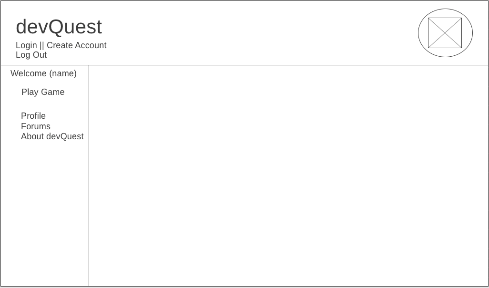

# devQuest
> or: How I learned Phaser 3 in 7 business days

## Table of Contents
* [Introduction](#introduction)
* [Live Link](#live-link)
* [Technologies](#technologies)
* [Dependencies](#dependencies)
* [Getting Started](#getting-started)
* [Wireframes](#wireframes)
* [User Stories](#user-stories)
* [Project Status](#project-status)
* [Notes and Reminders](#notes-and-reminders)
* [References](#references)

## Introduction
devQuest consists of two parts: a user-based forum, and a game made with Phaser 3.

## Link to Live Site
http://play-devquest.herokuapp.com

## Technologies
* HTML / CSS
* Javascript
* Phaser 3
* AngularJS
* ExpressJS
* NodeJS
* MongoDB / Mongoose
* MongoDB Atlas
* Git/Github
* Heroku

## Dependencies
* bcrypt v.3.0.6
* dotenv v.8.1.0
* express v.4.17.1
* express-session v.1.16.2
* mongoose v.5.7.1

## Getting Started
1. Fork the repo and clone it to your local machine
2. In your terminal, in the root folder, run: npm install
3. Run: node server.js
4. Open your browser and go to "localhost:3000"
5. Please note that even if you choose to run off your local machine, the app is formatted to connect to MongoDB Atlas.

## Wireframes

## User Stories
* Users should be able to create an account and log into that account with a password.
* Logged in users should be able to update their own profiles, including an avatar and short bio.
* Logged in users should be view the usernames, avatars, and bios of all other users.
* Logged in users should be able to read all forum posts.
* Logged in users should be able to post messages to the forum.
* Logged in users should be able to edit or delete messages that they themselves posted.
* Anyone should be able to go to the site and play the game.

## Project Status
Currently Complete, though I may return to it later as I learn more about Phaser.

## Notes and Reminders
Things that I would like to add as I better learn Phaser 3:
* A world map that users can use to navigate levels.
* Health and/or extra lives.
* An API call to update a leaderboard of logged in users.
* A volume control button.
* A way to interact with and kill enemies, possibly by stomping on them.

## References
Resources for this site and game were taken from the following:
* site bg: http://www.subtlepatterns.com
* forest bg: Eder Muniz
* blue sprite: https://craftpix.net/
* bat sprite: https://opengameart.org/users/bagzie
* music: https://soundcloud.com/pascalbelisle
* star, sound bites: https://ansimuz.itch.io/
* .json maps were created using Tiled: https://www.mapeditor.org/
